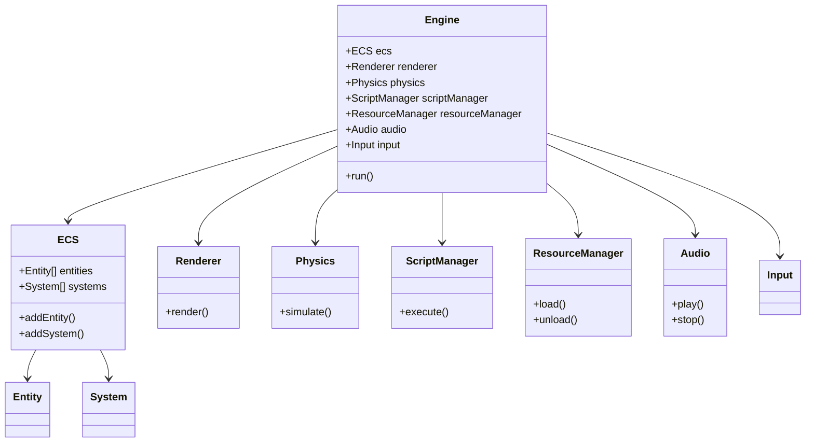

# Architecture Overview

## Introduction

The simplex-engine is a Python-based game engine designed for simplicity, flexibility, and rapid development. It leverages modern hardware capabilities and provides a unified development experience for game developers, video creators, and interactive media designers.

## High-Level Architecture

The engine is structured around the following core components:

- **ECS (Entity-Component-System):** Modular game logic, entities, components, and systems. Accepts both objects and string names for flexibility.
- **Renderer:** Handles graphics output (puopengl backend).
- **Physics:** Integrates pybullet for simulation.
- **ScriptManager:** Executes Python scripts, supports hot-reloading.
- **ResourceManager:** Centralized asset management (textures, models, audio, scripts).
- **Audio:** First-class subsystem for sound playback and management.
- **Input System:** Abstract API, currently uses pygame backend. Handles initialization internally, supports polling and event emission. Backend can be swapped for future extensibility.
- **Event System:** Decoupled communication between subsystems, extensible for priorities and async.

## Design Principles
- Modularity: Each subsystem is in its own module, with clear interfaces for replacement and extension.
- Extensibility: Event-driven architecture, pluggable subsystems, and configuration via TOML.
- Error Handling: Consistent use of logging and exceptions.
- Configuration: Centralized, extensible, and documented.
- Logging: Multi-level, centralized, extensible for future needs.

## Input System
- Initializes pygame and display automatically.
- Emits events via the event system.
- Backend can be swapped (future support for OS hooks, etc.).
- Robust error handling and logging.

## Demo Scene
- Example entry point showing subsystem interaction and event-driven flow.
- Loads configuration from examples/config.toml.

## Component Interaction

The architecture is designed for loose coupling and high extensibility. Each subsystem communicates via well-defined interfaces and the event system, enabling easy integration and replacement. Resource Manager and Audio System are first-class subsystems, supporting asset and sound management for games and media. The event system allows input, ECS, and other subsystems to interact dynamically.

## UML Diagram

Below is a simplified UML class diagram representing the main components and their relationships:

## Advantages

- **Unified Python Stack:** All subsystems use Python, enabling dynamic development and debugging.
- **Event-Driven Extensibility:** The event system allows for scalable, decoupled subsystem communication and future feature growth.
- **Robust Error Handling:** Subsystems include error handling and logging for reliability and easier debugging.
- **Centralized Configuration:** Supports extensible configuration management for engine and game settings.
- **Rapid Prototyping:** Immediate feedback and hot-reloading for faster iteration.
- **Extensible:** Easily add or replace components thanks to modular design.
- **Performance:** Designed to leverage improving hardware for better runtime efficiency.

## Summary

The simplex-engine architecture prioritizes developer experience, flexibility, and future-proofing. By combining ECS, modern rendering, physics, scripting, and an event-driven approach in Python, it empowers creators to build complex interactive systems with minimal friction. Centralized configuration, robust error handling, and demo scenes further support maintainability and onboarding for new developers.
