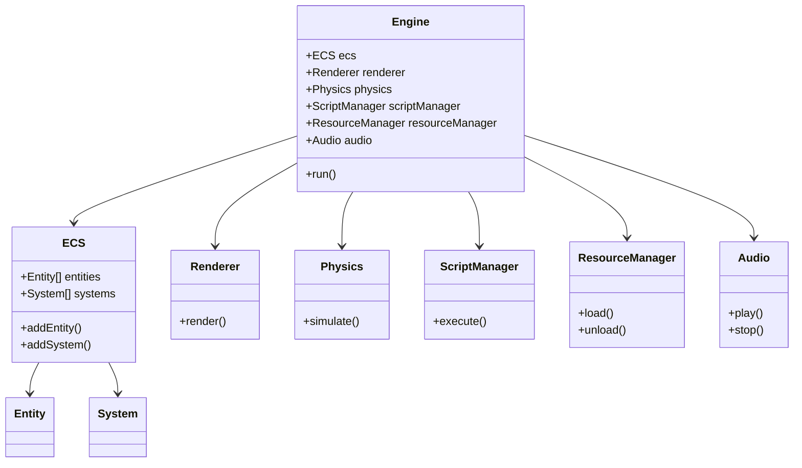

# Architecture Overview

## Introduction

The simplex-engine is a Python-based game engine designed for simplicity, flexibility, and rapid development. It leverages modern hardware capabilities and provides a unified development experience for game developers, video creators, and interactive media designers.

## High-Level Architecture

The engine is structured around the following core components:

- **ECS (Entity-Component-System):** Serves as the primary developer interface, enabling modular and scalable game logic.
- **puopengl:** Handles rendering and video output, optimized for real-time and cinematic experiences.
- **pybullet:** Integrates physics simulation for realistic interactions and dynamics.
- **Python Scripting:** Powers all logic and scripting, allowing dynamic behavior and rapid prototyping.
- **Resource Manager:** Centralizes asset loading/unloading, supports textures, models, audio, and scripts.
- **Audio System:** Manages audio playback and integration, supporting flexible sound features.

## Component Interaction

The architecture is designed for loose coupling and high extensibility. Each subsystem communicates via well-defined interfaces, enabling easy integration and replacement. Resource Manager and Audio System are first-class subsystems, supporting asset and sound management for games and media.

## UML Diagram

Below is a simplified UML class diagram representing the main components and their relationships:

## Advantages

- **Unified Python Stack:** All subsystems use Python, enabling dynamic development and debugging.
- **Rapid Prototyping:** Immediate feedback and hot-reloading for faster iteration.
- **Extensible:** Easily add or replace components thanks to modular design.
- **Performance:** Designed to leverage improving hardware for better runtime efficiency.

## Summary

The simplex-engine architecture prioritizes developer experience, flexibility, and future-proofing. By combining ECS, modern rendering, physics, and scripting in Python, it empowers creators to build complex interactive systems with minimal friction.
