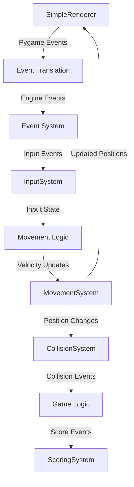
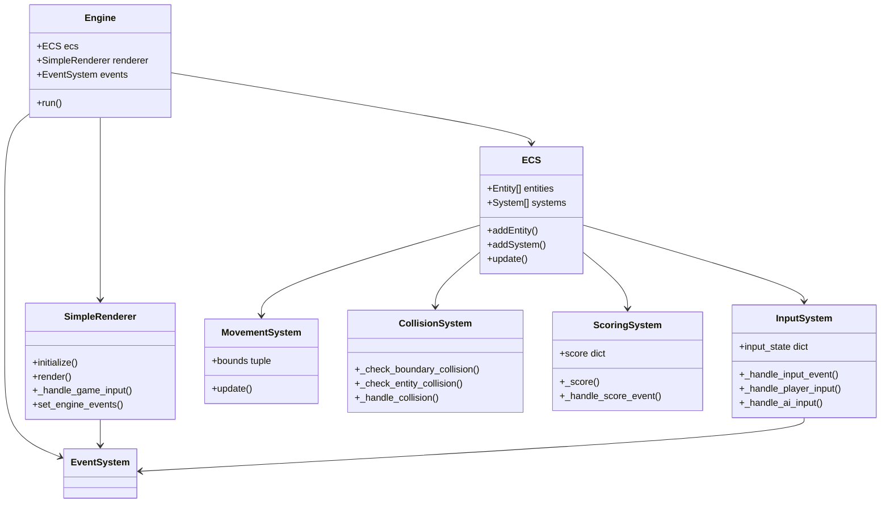
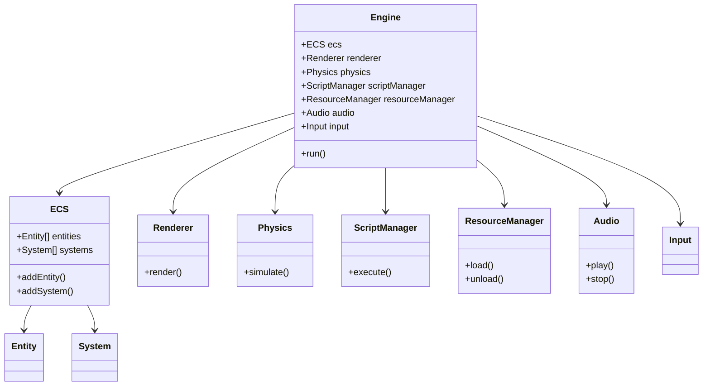

# Architecture Overview

## Introduction

The simplex-engine is a Python-based game engine designed for simplicity, flexibility, and rapid development. It leverages modern hardware capabilities and provides a unified development experience for game developers, video creators, and interactive media designers.

## High-Level Architecture

The engine is structured around the following core components:

- **ECS (Entity-Component-System):** Modular game logic with entities, components, and systems. Fully implemented with working examples.
- **Renderer:** Pygame-based graphics output with debug overlay support and entity rendering.
- **Input System:** Unified input pipeline with proper KEYUP/KEYDOWN handling, responsive controls for W/S/UP/DOWN keys.
- **Event System:** Decoupled communication between subsystems with event registration and emission.
- **Collision System:** AABB collision detection with boundary checking and entity-to-entity collision handling.
- **Movement System:** Velocity-based position updates with boundary enforcement.
- **Scoring System:** Game state management with win condition detection.

## Design Principles

- **Modularity:** Each subsystem is in its own module with clear interfaces for replacement and extension.
- **Event-Driven Architecture:** All systems communicate via unified event system for loose coupling.
- **Responsive Input:** Proper key press/release handling prevents input lag and "sticky" controls.
- **Error Handling:** Comprehensive logging and exception handling throughout all systems.
- **Configuration:** TOML-based configuration for engine and game settings.
- **Real-time Development:** Immediate feedback and debug tools for rapid iteration.

## Input System Architecture

The input system has been completely redesigned for reliability:

### Input Pipeline Flow
1. **Pygame Events** → Captured by SimpleRenderer in main render loop
2. **Event Translation** → Pygame KEYDOWN/KEYUP events converted to engine events
3. **Event Emission** → Engine events emitted via unified event system
4. **Input System Processing** → Events received and input state maintained
5. **Game Logic Response** → Systems query input state and update entity behavior

### Key Features
- **Unified Event Handling:** Single pygame event loop prevents event consumption conflicts
- **Proper State Management:** Input state correctly tracks key press and release
- **Responsive Controls:** No more "single press" limitation or sticky input
- **Event Forwarding:** Clean separation between renderer input capture and game logic
- **Debug Logging:** Comprehensive logging for input debugging and development

## ECS Implementation

### Core Components
- **PositionComponent:** Entity spatial coordinates (x, y, z)
- **VelocityComponent:** Movement vectors (vx, vy, vz)
- **CollisionComponent:** Collision bounds (width, height, mass)
- **RenderComponent:** Visual representation (primitive, color)
- **InputComponent:** Input behavior (input_type, speed)

### Active Systems
- **InputSystem:** Processes input events and maintains key state
- **MovementSystem:** Applies velocity to position with boundary checking
- **CollisionSystem:** Detects collisions between entities and boundaries
- **ScoringSystem:** Manages game scoring and win conditions

## Demo Scene - Ping-Pong Game

The engine includes a fully functional ping-pong game demonstrating:

### Game Features
- **Player Control:** Responsive W/S and UP/DOWN key controls
- **AI Opponent:** Intelligent paddle movement with ball tracking
- **Collision Physics:** Ball bounces off paddles with spin effects
- **Boundary Handling:** Proper collision with screen edges
- **Scoring System:** Point tracking with win condition (first to 5)
- **Real-time Display:** Live score updates and game state

### Technical Implementation
- **Entity Setup:** Player paddle, AI paddle, and ball entities
- **System Integration:** All ECS systems working together
- **Event Handling:** Physics collisions trigger ball behavior changes
- **Game Loop:** 60 FPS rendering with proper timing

## Component Interaction

## Recent Improvements

### Input System Fixes (Latest)
- **Fixed Input Responsiveness:** Resolved "single press" limitation
- **Proper Event Handling:** Both KEYDOWN and KEYUP events processed
- **Unified Pipeline:** Single event processing path prevents conflicts
- **Enhanced Logging:** Debug information for input troubleshooting
- **State Management:** Proper key state tracking and cleanup

### Game Development
- **Complete Ping-Pong Game:** Fully playable example demonstrating all systems
- **AI Implementation:** Smart opponent with ball tracking behavior
- **Enhanced Collisions:** Ball spin effects based on paddle hit position
- **Win Conditions:** Complete game flow with victory detection

## UML Diagram

Below is the current system architecture:

## UML Diagram

Below is a simplified UML class diagram representing the main components and their relationships:

## Advantages

- **Unified Python Stack:** All subsystems use Python, enabling dynamic development and debugging.
- **Event-Driven Extensibility:** The event system allows for scalable, decoupled subsystem communication and future feature growth.
- **Robust Error Handling:** Subsystems include error handling and logging for reliability and easier debugging.
- **Centralized Configuration:** Supports extensible configuration management for engine and game settings.
- **Rapid Prototyping:** Immediate feedback and hot-reloading for faster iteration.
- **Extensible:** Easily add or replace components thanks to modular design.
- **Performance:** Designed to leverage improving hardware for better runtime efficiency.

## Summary

The simplex-engine architecture prioritizes developer experience, flexibility, and future-proofing. By combining ECS, modern rendering, physics, scripting, and an event-driven approach in Python, it empowers creators to build complex interactive systems with minimal friction. Centralized configuration, robust error handling, and demo scenes further support maintainability and onboarding for new developers.
