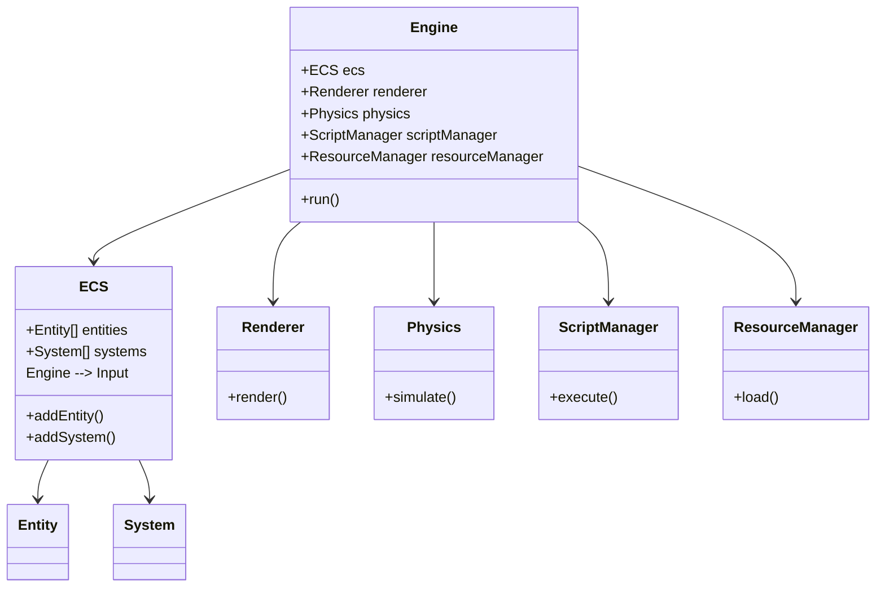

# MVP (Minimum Viable Product) Task List for simplex-engine

## MVP Definition
The MVP for simplex-engine is the minimal set of features required to build and run a simple interactive game scene, demonstrating the engine's core capabilities and extensibility.

## Sorted MVP Task List

### 1. Core Engine Loop
- [ ] Implement Engine main loop
- [ ] Centralize and extend configuration management
- [ ] Integrate unified event system for subsystem communication
### 2. ECS (Entity-Component-System)
- [ ] Implement ECS core (Entity, Component, System management)

### 3. Input System
- [ ] Design abstract Input system API
- [ ] Implement pygame backend for input
- [ ] Support polling and state retrieval for keyboard, mouse, and gamepad
- [ ] Integrate input events with ECS and game logic
- [ ] Document API for future backend replacement

### 4. Renderer
- [ ] Add camera and viewport management

### 4. Physics
- [ ] Integrate pybullet for physics simulation

- Input System (abstract API, pygame backend)
### 6. Resource Manager
- [ ] Implement ResourceManager for asset loading (textures, models)
- [ ] Plan and implement robust error handling for resource management

## MVP Analysis

The minimal set of MVP features includes:
- Engine main loop
- ECS core (Entity, Component, System)
- Input System (abstract API, pygame backend)
- Renderer (basic primitives, camera)
- Physics (basic simulation)
- ScriptManager (game logic API)
- ResourceManager (basic asset loading)
- Unified event system for subsystem communication
- Centralized configuration management
- Robust error handling in resource and input systems
- Example projects and demo scenes for validation

Audio and advanced features (hot-reloading, advanced materials, demo scenes) are not required for the MVP but can be added after the core is functional.

## MVP UML Design

---
This MVP list and design focus on delivering a functional, extensible engine foundation. Update as development progresses.
